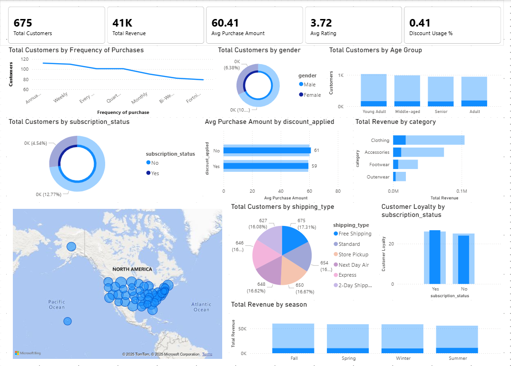

# Customer Behavior Analysis – Power BI | SQL | Python

## 📌 Project Overview
This project analyzes customer behavior using real-world data to identify purchasing patterns, customer segments, and key business insights. The analysis was performed using Python for data cleaning, SQL for querying, and Power BI for visualization.

## 🛠 Tools & Technologies
- Python (Pandas, NumPy)
- Jupyter Notebook
- SQL
- Power BI
- CSV Dataset

## 📂 Project Structure

```
customer-behavior-analysis/
│
├── data/
│   └── customer_data.csv
│
├── powerbi/
│   ├── customer_analysis.pbix
│   └── dashboard_screenshot.png
│
├── sql/
│   └── analysis_queries.sql
│
├── notebooks/
│   └── data_cleaning.ipynb
│
└── README.md
```

## 🔄 Workflow
1. Imported raw CSV data
2. Cleaned and preprocessed data using Python
3. Performed analytical queries using SQL
4. Built an interactive Power BI dashboard
5. Derived insights for decision-making

## 📊 Key Insights
- Identified high-value customer segments
- Analyzed purchase frequency and spending trends
- Measured customer retention patterns
- Highlighted top-performing categories

## 📷 Power BI Dashboard Preview


## 🚀 How to Use
1. Clone the repository
2. Open the Jupyter notebook to see data cleaning steps
3. Run SQL queries for analysis
4. Open the Power BI `.pbix` file to explore the dashboard

## 📈 Future Improvements
- Add predictive analytics
- Automate data refresh
- Deploy dashboard online

---
⭐ If you found this project useful, feel free to star the repository!

